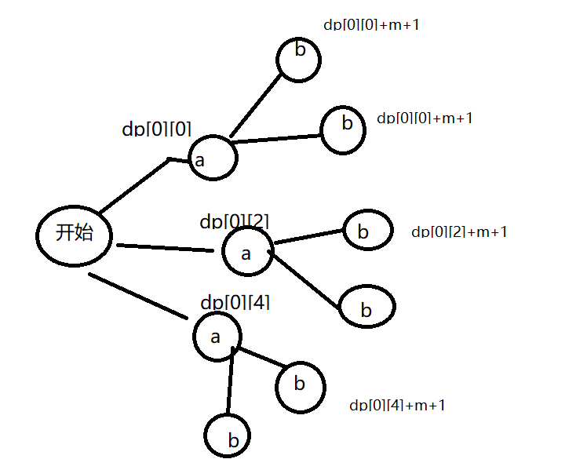

# 514 自由之路
难度：困难   
题目地址：https://leetcode-cn.com/problems/freedom-trail/   
完成时间： 2020/11/11
# 题目
视频游戏“辐射4”中，任务“通向自由”要求玩家到达名为“Freedom Trail Ring”的金属表盘，并使用表盘拼写特定关键词才能开门。

给定一个字符串 ring，表示刻在外环上的编码；给定另一个字符串 key，表示需要拼写的关键词。您需要算出能够拼写关键词中所有字符的最少步数。

最初，ring 的第一个字符与12:00方向对齐。您需要顺时针或逆时针旋转 ring 以使 key 的一个字符在 12:00 方向对齐，然后按下中心按钮，以此逐个拼写完 key 中的所有字符。

旋转 ring 拼出 key 字符 key[i] 的阶段中：

1. 您可以将 ring 顺时针或逆时针旋转一个位置，计为1步。旋转的最终目的是将字符串 ring 的一个字符与 12:00 方向对齐，并且这个字符必须等于字符 key[i] 。
2. 如果字符 key[i] 已经对齐到12:00方向，您需要按下中心按钮进行拼写，这也将算作 1 步。按完之后，您可以开始拼写 key 的下一个字符（下一阶段）, 直至完成所有拼写。      

**示例：**   

```
输入: ring = "godding", key = "gd"
输出: 4
解释:
 对于 key 的第一个字符 'g'，已经在正确的位置, 我们只需要1步来拼写这个字符。 
 对于 key 的第二个字符 'd'，我们需要逆时针旋转 ring "godding" 2步使它变成 "ddinggo"。  
 当然, 我们还需要1步进行拼写。
 因此最终的输出是 4。
```
**提示：**

1. ring 和 key 的字符串长度取值范围均为 1 至 100；
2. 两个字符串中都只有小写字符，并且均可能存在重复字符；
3. 字符串 key 一定可以由字符串 ring 旋转拼出。

# 思路
首先，明确这道题采用动态规划解决。   

1. 我们用 dp[i][j] 表示从游戏开始到拼接完成 key[0:i] 在 ring[j]==key[i] 的时候最小步数。
2. 比如一下情况：
    ring="ababac"  
    key="ab"    
    第一步 我们先开始拼接 a，我们要把 ring 中每一个a都计算到。  
    计算的结果是：   
        dp[0][0]=0-0+1 = 1  
        dp[0][2]=abs(0-2)+1 = 3  
        dp[0][4]=ring.len-abs(0-4)+1 = 3  
    因为存在重复字符串，所以我们把所有重复的位置都考虑到。   
3. 状态转移方程：  
    dp[i][j] = min(dp[i][j], dp[i - 1][k] + min(m) + 1, nlen - abs(m) + 1))   
    m 是当前位置和上个位置的距离


这道题主要参考了题解中的思路：   
https://leetcode-cn.com/problems/freedom-trail/solution/dong-tai-gui-hua-xiang-xi-jie-shi-bei-keng-de-xian/
这里这张思路图很重要：


# 代码
java实现
```
class Solution {
    //标准动态规划
    public int findRotateSteps(String ring, String key) {
        int nLen = ring.length();
        int kLen = key.length();
        //使用pos<List>数组记录ring中各个字母出现的位置。
        List<Integer>[] pos = new List[26];
        for (int i = 0; i < 26; i++) {
            pos[i] = new ArrayList<>();
        }
        for (int i = 0; i < nLen; i++) {
            pos[ring.charAt(i) - 'a'].add(i);
        }

        //用dp[i][j] 表示从游戏开始到拼接完成key[0:i] 在ring[j]==key[i]的时候最小步数
        int[][] dp = new int[kLen][nLen];
        for (int i = 0; i < kLen; i++) {
            Arrays.fill(dp[i], 0x3f3f3f);
        }
        //首先给dp[0]各个可能性赋值
        for (int i : pos[key.charAt(0) - 'a']) {
            dp[0][i] = Math.min(i + 1, nLen - i + 1);
        }
        //
        for (int i = 1; i < kLen; i++) {
            for (int j : pos[key.charAt(i) - 'a']) {
                for (int k : pos[key.charAt(i - 1) - 'a']) {
                    //这句话是代码核心，转移方程  
                    dp[i][j] = Math.min(dp[i][j], dp[i - 1][k] + Math.min(Math.abs(j - k) + 1, nLen - Math.abs(j - k) + 1));
                }
            }
        }
        return Arrays.stream(dp[kLen - 1]).min().getAsInt();
    }
}
```
python实现：
```
class Solution:
    # 标准动态规划
    def findRotateSteps(self, ring: str, key: str) -> int:
        nlen = len(ring)
        klen = len(key)
        # 使用pos数组记录ring中各个字母出现的位置。
        pos = [list() for i in range(26)]
        for i in range(nlen):
            pos[ord(ring[i]) - ord('a')].append(i)
        
        # 用dp[i][j] 表示从游戏开始到拼接完成key[0:i] 在ring[j]==key[i]的时候最小步数
        dp = [[0x3f3f3f] * nlen for i in range(klen)]
        # 首先给dp[0]各个可能性赋值
        for i in pos[ord(key[0]) - ord('a')]:
            dp[0][i] = min(i + 1, nlen - i + 1)
        
        for i in range(1, klen):
            for j in pos[ord(key[i]) - ord('a')]:
                for k in pos[ord(key[i - 1]) - ord('a')]:
                    # 这句话是代码核心，转移方程
                    dp[i][j] = min(dp[i][j], dp[i - 1][k] + min(abs(k- j) + 1, nlen - abs(k - j) + 1))
        
        return min(dp[klen - 1])
```

# 其他
```
java求数组A最小值可以使用方法：   
Arrays.stream(A).min().getAsInt();  

py求数组A最小值可以使用方法：  
min(A)  

py声明数组得使用：
dp = [[0] * nlen for i in range(klen)]
pos = [list() for i in range(26)]     # 数组每个元素为list()
```